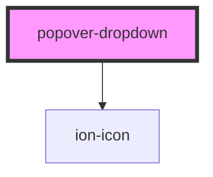

# popover-dropdown

<!-- Auto Generated Below -->

## Properties

| Property      | Attribute      | Description                                                                                 | Type       | Default     |
| ------------- | -------------- | ------------------------------------------------------------------------------------------- | ---------- | ----------- |
| `firstOption` | `first-option` | The first option to be displayed, if it's empty it'll show the first one on options array.  | `string`   | `undefined` |
| `icon`        | `icon`         | The icon displayed at the right side of the popover description. It uses ionicons v6 icons. | `string`   | `undefined` |
| `options`     | --             | The options list of the popover.                                                            | `Option[]` | `undefined` |

## Dependencies

### Depends on

- ion-icon

### Graph

----------------------------------------------

*Built with [StencilJS](https://stenciljs.com/)*
