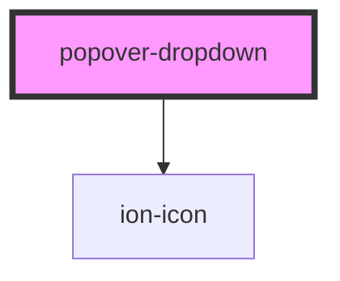

![Built With Stencil](https://img.shields.io/badge/-Built%20With%20Stencil-16161d.svg?logo=data%3Aimage%2Fsvg%2Bxml%3Bbase64%2CPD94bWwgdmVyc2lvbj0iMS4wIiBlbmNvZGluZz0idXRmLTgiPz4KPCEtLSBHZW5lcmF0b3I6IEFkb2JlIElsbHVzdHJhdG9yIDE5LjIuMSwgU1ZHIEV4cG9ydCBQbHVnLUluIC4gU1ZHIFZlcnNpb246IDYuMDAgQnVpbGQgMCkgIC0tPgo8c3ZnIHZlcnNpb249IjEuMSIgaWQ9IkxheWVyXzEiIHhtbG5zPSJodHRwOi8vd3d3LnczLm9yZy8yMDAwL3N2ZyIgeG1sbnM6eGxpbms9Imh0dHA6Ly93d3cudzMub3JnLzE5OTkveGxpbmsiIHg9IjBweCIgeT0iMHB4IgoJIHZpZXdCb3g9IjAgMCA1MTIgNTEyIiBzdHlsZT0iZW5hYmxlLWJhY2tncm91bmQ6bmV3IDAgMCA1MTIgNTEyOyIgeG1sOnNwYWNlPSJwcmVzZXJ2ZSI%2BCjxzdHlsZSB0eXBlPSJ0ZXh0L2NzcyI%2BCgkuc3Qwe2ZpbGw6I0ZGRkZGRjt9Cjwvc3R5bGU%2BCjxwYXRoIGNsYXNzPSJzdDAiIGQ9Ik00MjQuNywzNzMuOWMwLDM3LjYtNTUuMSw2OC42LTkyLjcsNjguNkgxODAuNGMtMzcuOSwwLTkyLjctMzAuNy05Mi43LTY4LjZ2LTMuNmgzMzYuOVYzNzMuOXoiLz4KPHBhdGggY2xhc3M9InN0MCIgZD0iTTQyNC43LDI5Mi4xSDE4MC40Yy0zNy42LDAtOTIuNy0zMS05Mi43LTY4LjZ2LTMuNkgzMzJjMzcuNiwwLDkyLjcsMzEsOTIuNyw2OC42VjI5Mi4xeiIvPgo8cGF0aCBjbGFzcz0ic3QwIiBkPSJNNDI0LjcsMTQxLjdIODcuN3YtMy42YzAtMzcuNiw1NC44LTY4LjYsOTIuNy02OC42SDMzMmMzNy45LDAsOTIuNywzMC43LDkyLjcsNjguNlYxNDEuN3oiLz4KPC9zdmc%2BCg%3D%3D&colorA=16161d&style=flat-square)

# Popover Dropdown

This is a web-component built with Stencil that presents a custom popover that can receive a any callback functions that will be called on click.


## Install

```bash
npm i @carbonaut/popover-dropdown --save
```

## Getting Started

To get our component up and running on your app, follow the steps for your framework (or Vanilla JS):

**Vanilla JS:**

1. Add the package's module on a `script` tag inside your `head` tag in your `index.html` file:

```
<script type='module' src='https://unpkg.com/@carbonaut/popover-dropdown@0.0.2/dist/popover-dropdown/popover-dropdown.esm.js'></script>
</head>
```

2. Apply the component to html and then attach the options attibutes to the component using JavaScript:

_HTML_

```html
<popover-dropdown></popover-dropdown>
```

_JavaScript_

```js
const popoverDropdown = document.querySelector('popover-dropdown');
popoverDropdown.firstOption = 'Deutsch';
popoverDropdown.icon = 'globe-outline';
popoverDropdown.options = [
  { label: 'Deutsch', callback: () => {} },
  { label: 'English', callback: () => {} },
  { label: 'Español', callback: () => {} },
];
```

**Angular**

1. Add `defineCustomElements` function to your `main.ts` file:

```ts
import { defineCustomElements } from '@carbonaut/popover-dropdown/loader';

defineCustomElements(window);
```

2. On the `module.ts` file you're going to use the component add `CUSTOM_ELEMENTS_SCHEMA` to your schema configuration

```ts
import { CUSTOM_ELEMENTS_SCHEMA } from '@angular/core';


@NgModule({
  imports: [
    ...
  ],
  declarations: [...],
  schemas: [CUSTOM_ELEMENTS_SCHEMA],
})
```

3. Use the component on your HTML template page and attach the option properties through your `.ts` file;

your-page.page.html

```html
<popover-dropdown [options]="options" [firstOption]="firstOption" [icon]="icon"></popover-dropdown>
```

your-page.page.ts

```ts
export class ExamplePage {
  options: Option[] = [
    { label: 'Deutsch', callback: () => {} },
    { label: 'English', callback: () => {} },
    { label: 'Español', callback: () => {} },
  ];

  icon: string = 'globe-outline';

  firstOption: string = 'Deutsch';
```

## Types and attributes

```ts
option: {
  label: string;
  callback: () => {};
}

firstOption: string;
```

<!-- Auto Generated Below -->

## Properties

| Property      | Attribute      | Description                                                                                 | Type       | Default     |
| ------------- | -------------- | ------------------------------------------------------------------------------------------- | ---------- | ----------- |
| `firstOption` | `first-option` | The first option to be displayed, if it's empty it'll show the first one on options array.  | `string`   | `undefined` |
| `icon`        | `icon`         | The icon displayed at the right side of the popover description. It uses ionicons v6 icons. | `string`   | `undefined` |
| `options`     | --             | The options list of the popover.                                                            | `Option[]` | `undefined` |

## Dependencies

### Depends on

- ion-icon

### Graph



---

_Built with [StencilJS](https://stenciljs.com/)_
